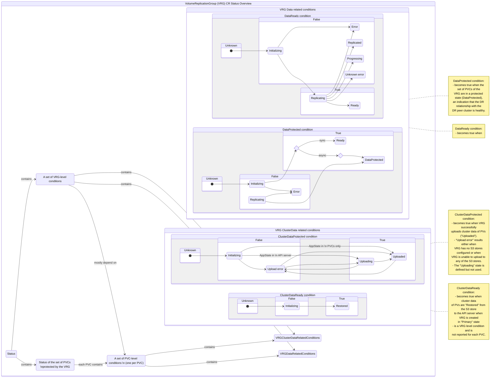

# VolumeReplicationGroup (VRG) CR Status Conditions

This page outlines the various conditions reported by the VolumeReplicationGroup (VRG) CR that is deployed on the DR cluster. For the hub cluster related CR conditions, see [DRPC CR Status Conditions](drpc-status-conditions.md) and [DRPolicy CR Status Conditions](drpolicy-status-conditions.md).

